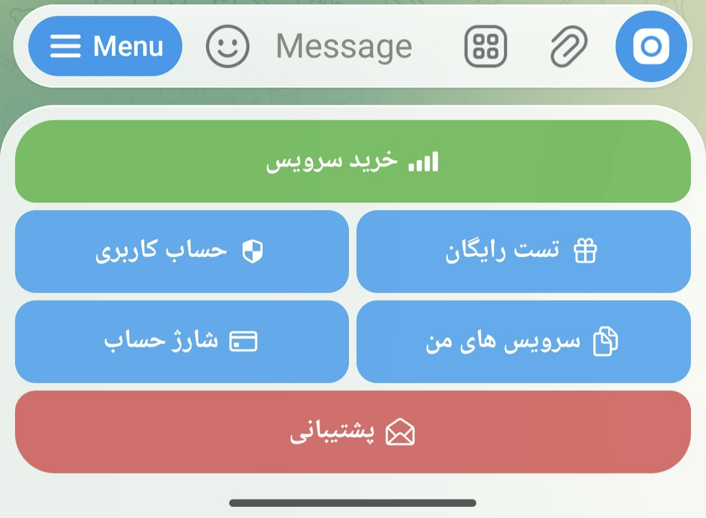
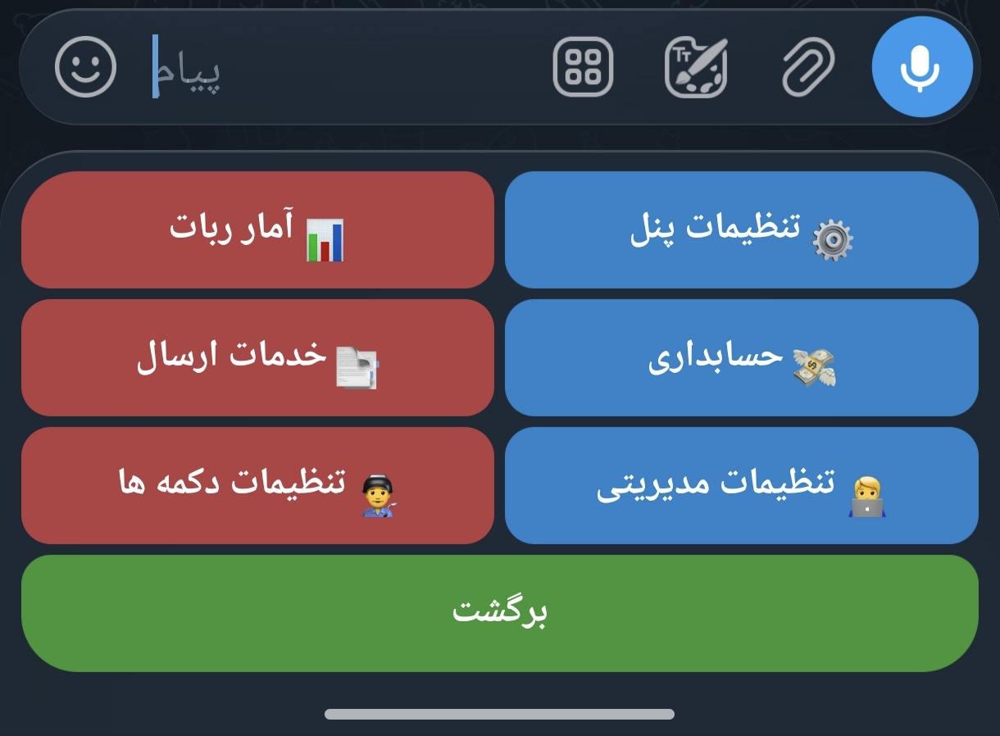

# ZitaSaz
پروژه رایگان ساخت ربات مدیریت و فروش کانفیگ

🔎 آموزش متنی ساخت ربات متصل به پنل سنایی و پاسارگارد کاملا رایگان :

• اتصال به پنل سنایی
• ساخت سرویس تست
• نمایش اطلاعات کانفیگ
• سیستم گزارش دهی حرفه ای 
• و...

📌 جهت ساخت ربات :

1: وارد ربات تلگرامی : @botfather شوید
2: دستور /newbot را ارسال کنید
3: یک نام فارسی یا انگلیسی وارد کنید
4: یوزرنیم ربات خودتون ثبت کنید
5: توکن رباتتون کپی کنید
6: وارد رباتساز : @Zitasazbot شوید
7: روی ایجاد ربات را کلیک کنید
8: توکن رباتتون ارسال کنید و صبر کنید
9: ربات شما متصل شد و آمادست
10: وارد ربات خودتون بشید و دستور پنل را ارسال کنید تا به پنل مدیریت دسترسی پیدا کنید
🔥 پیشنهادی ، انتقادی ، سوالی داشتید با ما در میان بگذارید :

👤 @Devbc
🔐 @ZitacTm

 

